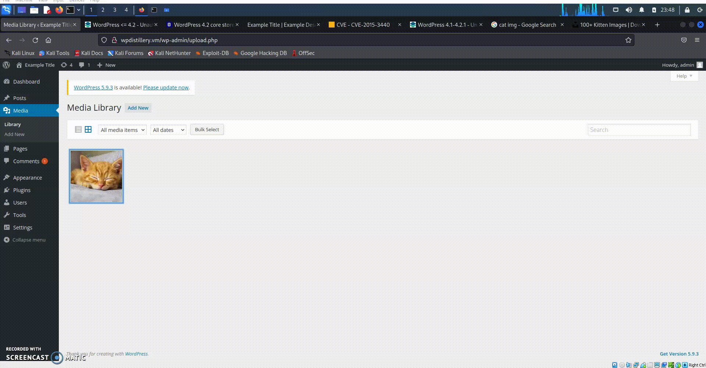

# Project 7 - WordPress Pentesting

Time spent: **13** hours spent in total

> Objective: Find, analyze, recreate, and document **five vulnerabilities** affecting an old version of WordPress

## Pentesting Report

### 1. (Required)Title: WordPress <= 4.2 - Unauthenticated Stored Cross-Site Scripting (XSS)
  - [x] Summary: Any version 4.2 or below 4.2 are vulnerable to being a stored XSS. A hacker can attack by using JavaScript that is injected into the comments of WordPress allowing it to skip the pending of the admin
    - Vulnerability types: XSS
    - Tested in version: 4.2
    - Fixed in version: 4.2.1
  - [x] GIF Walkthrough: 
    
  - [x] Steps to recreate: To get pass the admin's approval to the comment, the comment need to have an harmful html tag. In the html, you would want the text to long enough that it passes the size of 64 kb.
  - [x] Affected source code: ``
    - [Link 1](https://wpscan.com/vulnerability/8051e64b-f73e-45ce-a853-02b8e425155b)
    - [Link_2](https://cve.mitre.org/cgi-bin/cvename.cgi?name=CVE-2015-3440)
    - [Link_3](https://www.exploit-db.com/exploits/36844/)
### 2. Title: WordPress 2.5-4.6 - Authenticated Stored Cross-Site Scripting via Image Filename
  - [x] Summary: There is a Cross-Site scripting (XSS) vulnerability in the media tab in the admin's WordPress. An attacker can input an web script or a HTML allowing the admin to think that the admin is uploading an image file with a modified filename.
    - Vulnerability types: XSS
    - Tested in version: 4.2
    - Fixed in version: 4.6.1
  - [x] GIF Walkthrough: 
    
  - [x] Steps to recreate: An admin needs to approve an image that was created with a modified filename which will trigger an XSS with an alert whenever the admin loads in the image.
  - [x] Affected source code: `You-Just-Got-Hacked`
    - [Link 1](https://wpscan.com/vulnerability/21169b6d-61dd-4abc-b77b-167ff5f122ac)
    - [Link_2](https://wpscan.com/vulnerability/e84eaf3f-677a-465a-8f96-ea4cf074c980)
    - [Link_3](https://cve.mitre.org/cgi-bin/cvename.cgi?name=CVE-2016-7168)
### 3. Title: WordPress  4.0-4.7.2 - Authenticated Stored Cross-Site Scripting (XSS) in YouTube URL Embeds
  - [x] Summary: Attackers using cross-site scripting (XSS) vulnerability by inputing harmful JavaScript code with YouTube URL Embeded in the post which the admin approved.
    - Vulnerability types: (XSS)
    - Tested in version: 4.2
    - Fixed in version: 4.7.3
  - [x] GIF Walkthrough: 
  
  - [x] Steps to recreate: The admin needs to approve a post that his a YouTube URL that has been embeded in the URL. Everythime the user refreshes or clicks on the date of the post, they will get a alert to pop out.
  - [x] Affected source code: `[embed src='https://youtube.com/embed/12345\x3csvg onload=alert(123)\x3e'][/embed]`
    - [Link 1](https://wpscan.com/vulnerability/3ee54fc3-f4b4-4c35-8285-9d6719acecf0)
    - [Link_2](https://cve.mitre.org/cgi-bin/cvename.cgi?name=CVE-2017-6817)
    - [Link_3](https://wordpress.org/news/2017/03/wordpress-4-7-3-security-and-maintenance-release/)
    - [Link_4](https://blog.sucuri.net/2017/03/stored-xss-in-wordpress-core.html)
### 4. (Optional) Vulnerability Name or ID
  - [ ] Summary: 
    - Vulnerability types:
    - Tested in version:
    - Fixed in version: 
  - [ ] GIF Walkthrough: 
  - [ ] Steps to recreate: 
  - [ ] Affected source code:
    - [Link 1](https://core.trac.wordpress.org/browser/tags/version/src/source_file.php)
### 5. (Optional) Vulnerability Name or ID
  - [ ] Summary: 
    - Vulnerability types:
    - Tested in version:
    - Fixed in version: 
  - [ ] GIF Walkthrough: 
  - [ ] Steps to recreate: 
  - [ ] Affected source code:
    - [Link 1](https://core.trac.wordpress.org/browser/tags/version/src/source_file.php) 

## Assets

List any additional assets, such as scripts or files

## Resources

- [WordPress Source Browser](https://core.trac.wordpress.org/browser/)
- [WordPress Developer Reference](https://developer.wordpress.org/reference/)

GIFs created with [LiceCap](http://www.cockos.com/licecap/).

## Notes

Describe any challenges encountered while doing the work

## License

    Copyright [2022] [Hamza Ali]

    Licensed under the Apache License, Version 2.0 (the "License");
    you may not use this file except in compliance with the License.
    You may obtain a copy of the License at

        http://www.apache.org/licenses/LICENSE-2.0

    Unless required by applicable law or agreed to in writing, software
    distributed under the License is distributed on an "AS IS" BASIS,
    WITHOUT WARRANTIES OR CONDITIONS OF ANY KIND, either express or implied.
    See the License for the specific language governing permissions and
    limitations under the License.
